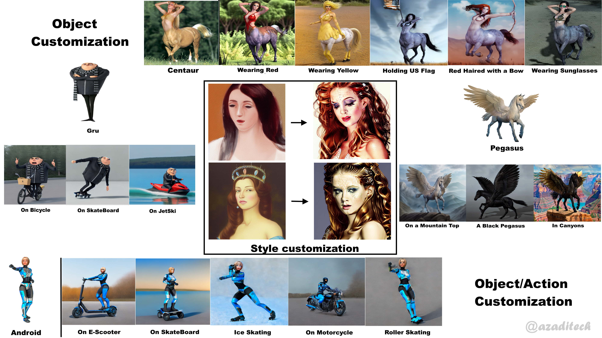
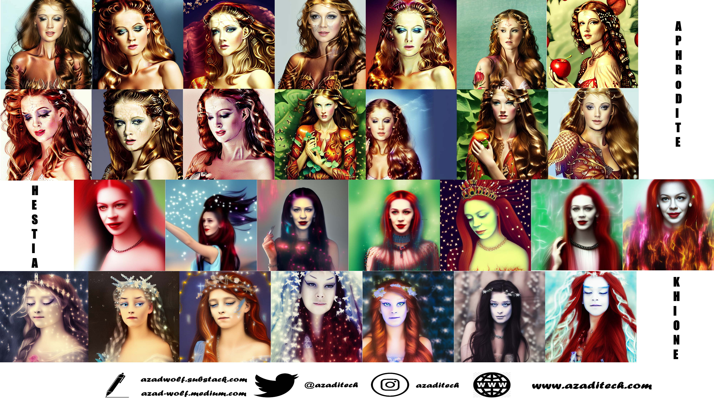
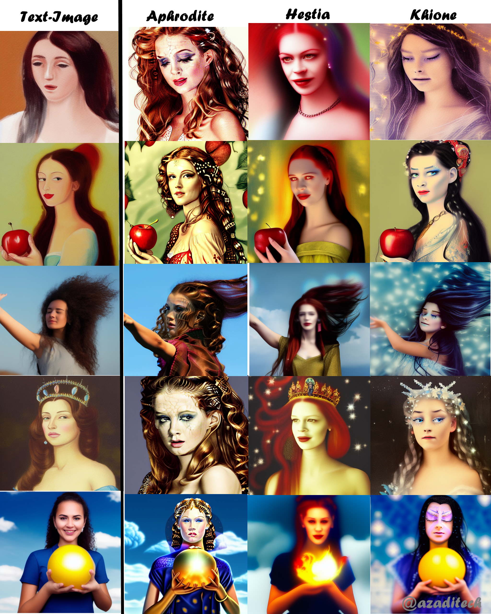

# Beyond Diffusion: What is Personalized Image Generation and How Can You Customize Image Synthesis?
## Personalized Image Generation by Fine-Tuning the Stable Diffusion Models  
  

  

## Requirements

If you would like to run it on your own PC instead then make sure you have sufficient hardware resources. Setup a Conda environment with python 3.10.6 and pytorch > 1.16.

## Running The Notebook

* Open the Notebook in Google Colab or local jupyter server
* Make sure GPU is selected in the runtime (Runtime->Change Type->GPU)
* Install the requirements
* Run the code in the example sections 
* In case of GPU out of memory error, make sure that the model from one example is cleared before running another example. Alternatively, you can restart the runtime and run that particular example directly instead of running the whole notebook.

## The tutorial 📃

The full tutorial is available on medium.

https://azad-wolf.medium.com/beyond-diffusion-what-is-personalized-image-generation-and-how-can-you-customize-image-synthesis-26a89d5b335

  

## Object Customization using Textual Inversion

  
## Object Customization using DreamBooth

  
## Style Capture & Generation using TextualInversion

  
 

  
## Style/Pose Transfer using TextualInversion

 

  

## References 

[1] Jonathan Ho, Ajay Jain, Pieter Abbeel, "Denoising Diffusion Probabilistic Models", 2020

[2] Robin Rombach and Andreas Blattmann and Dominik Lorenz and Patrick Esser and Björn Ommer, "High-Resolution Image Synthesis with Latent Diffusion Models", arXiv:2112.10752, 2021

[3] Rinon Gal, Yuval Alaluf, Yuval Atzmon, Or Patashnik, Amit H. Bermano, Gal Chechik, Daniel Cohen-Or
, "An Image is Worth One Word: Personalizing Text-to-Image Generation using Textual Inversion", arXiv:2208.01618, 2022

[4] Nataniel Ruiz, Yuanzhen Li, Varun Jampani, Yael Pritch, Michael Rubinstein, Kfir Aberman, "DreamBooth: Fine Tuning Text-to-Image Diffusion Models for Subject-Driven Generation", arXiv:2208.12242, 2022

